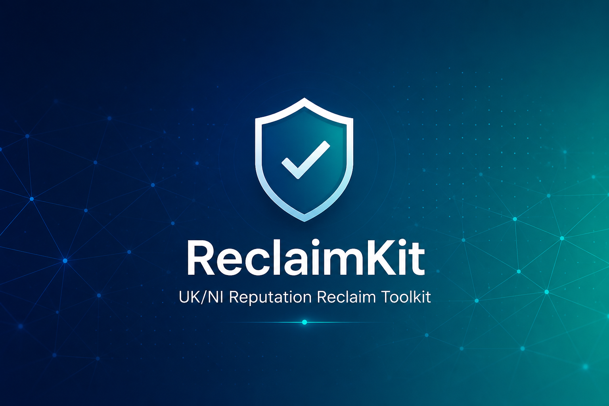

<p align="center">
  
</p>

<h1 align="center">ReclaimKit</h1>

<p align="center">
  <strong>Reputation Reclaim Toolkit</strong><br/>
  Multi-round privacy campaigns · Daily monitoring · Docker automation
</p>

<p align="center">
  
  
  
</p>

---

> Remove harmful social posts and search results using **privacy erasure requests** — the same emails and forms reputation firms charge hundreds or thousands of dollars to send.

---

# Test and deploy (any platform)

ReclaimKit runs in four phases:

| Phase | What | Sends emails? |
|-------|------|---------------|
| **1. Test** | Health check + dry-run | No |
| **2. Configure** | Edit `config.yaml`, add screenshots | No |
| **3. Deploy** | Start Docker (daily automation) | Only if auto-email enabled |
| **4. Go live** | Email platform privacy team, record send | Yes — you send Round 1 |

**Full audit (developers):** `./scripts/audit.sh` — runs 20 tests, doctor, optional PDF build.

---

## Quick setup

### Windows 11 (WSL + Docker)

1. Install **Docker Desktop** → **Running**
2. Install **Ubuntu**: PowerShell Admin → `wsl --install -d Ubuntu`
3. Docker Desktop → **Settings → WSL Integration → Ubuntu ON**
4. Open **Ubuntu** (`useradmin@DESKTOP:~$` — not `PS C:\`)

```bash
sudo apt update && sudo apt install -y git
git clone https://github.com/tgollogly/ReclaimKit.git ~/reclaimkit
cd ~/reclaimkit
chmod +x scripts/wsl-setup-and-test.sh
./scripts/wsl-setup-and-test.sh
```

Pass = **`SETUP COMPLETE`**

**Or from PowerShell (one line):**

```powershell
irm https://raw.githubusercontent.com/tgollogly/ReclaimKit/main/scripts/setup-windows.ps1 | iex
```

**After setup — edit config** (do **not** run `nano` in PowerShell; it only works in Linux):

```powershell
wsl -d Ubuntu nano ~/reclaimkit/config.yaml
```

Or open **Ubuntu** from the Start menu and run `nano ~/reclaimkit/config.yaml`.

**Re-run setup** without deleting: `./scripts/wsl-setup-and-test.sh` (inside Ubuntu).  
**Fresh reinstall:** `./scripts/wsl-reset-repo.sh` then `./scripts/wsl-setup-and-test.sh`.

### Linux / Mac

```bash
git clone https://github.com/tgollogly/ReclaimKit.git
cd ReclaimKit
pip install -r requirements.txt
python3 main.py init
python3 main.py doctor
python3 main.py daemon once --dry-run
python3 -m pytest tests/ -v
cd deploy && docker compose up -d --build
```

### Cloud VPS (24/7 automation)

```bash
git clone https://github.com/tgollogly/ReclaimKit.git ~/reclaimkit
cd ~/reclaimkit
cp config.example.yaml config.yaml && nano config.yaml
python3 main.py campaign init
cd deploy && docker compose up -d --build
./scripts/check-autosave.sh
```

See [deploy/VPS-GUIDE.md](deploy/VPS-GUIDE.md)

---

## Configure (any country)

Edit `config.yaml`:

```yaml
subject:
  full_name: "Your Name"
  email: "you@example.com"
  country: "Your country"

jurisdiction:
  privacy_law: "GDPR"              # or CCPA, LGPD, etc.
  erasure_article: "Article 17"
  regulator_name: "your data protection authority"
  regulator_url: "https://example.com/complaint"
  google_delisting_region: "Your country"
```

Regenerate letters: `python3 main.py campaign init`

---

## Daily commands (laptop or VPS)

```bash
cd ~/reclaimkit/deploy
docker compose ps
docker compose run --rm reclaimkit python3 main.py campaign status
docker compose run --rm reclaimkit python3 main.py campaign sent --track meta --round 1
```

---

## Autosave (enabled by default)

Docker bind-mounts your data to disk — closing the terminal does **not** delete anything:

| Saved | Path |
|-------|------|
| Config | `~/reclaimkit/config.yaml` |
| Letters + progress | `~/reclaimkit/output/` |
| Screenshots | `~/reclaimkit/evidence/` |

Verify: `./scripts/check-autosave.sh`

---

## Laptop vs VPS

| | Laptop | Cloud VPS |
|---|--------|-----------|
| Cost | Free | ~$5/mo |
| Runs when PC off? | No (Docker Desktop must run) | Yes |
| Best for | Setup, editing, sending Round 1 | Background monitoring |

---

## Documentation

| Guide | Purpose |
|-------|---------|
| [docs/QUICK-START.md](docs/QUICK-START.md) | Minimum steps |
| [docs/WINDOWS-WSL-DOCKER.md](docs/WINDOWS-WSL-DOCKER.md) | Windows setup |
| [docs/AUTO-EMAIL-SETUP.md](docs/AUTO-EMAIL-SETUP.md) | Optional SMTP |
| [deploy/VPS-GUIDE.md](deploy/VPS-GUIDE.md) | Cloud server |

---

## License

MIT License — Copyright © 2026 [tgollogly](https://github.com/tgollogly). See [LICENSE](LICENSE).

## Legal disclaimer

ReclaimKit generates letter templates and tracks your campaign workflow. It is **not legal advice** and does not create an attorney-client relationship. Privacy and platform-removal laws vary by country — consult a qualified professional in your jurisdiction before sending correspondence.

ReclaimKit is **not affiliated with** Meta, Google, Removify, Erase.com, or any reputation-management service. Platform decisions are theirs alone. You are solely responsible for how you use generated letters and any outcomes.

The Software is provided **"as is"** under the MIT License, without warranty of any kind.
