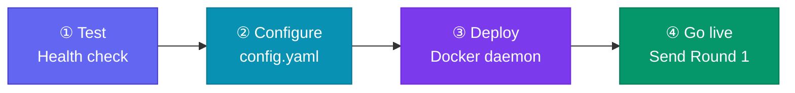

<p align="center">
  
</p>

<h1 align="center">ReclaimKit</h1>

<p align="center">
  <strong>Reputation Reclaim Toolkit</strong><br/>
  Multi-round privacy campaigns · Daily monitoring · Docker automation
</p>

<p align="center">
  
  
  
  
  
</p>

<p align="center">
  <a href="#four-phase-workflow"></a>
  <a href="#quick-setup"></a>
  <a href="#configure-any-country"></a>
  <a href="#documentation"></a>
</p>

<br/>

> [!IMPORTANT]
> Remove harmful social posts and search results using **privacy erasure requests** — the same emails and forms reputation firms charge hundreds or thousands of dollars to send.

<br/>

## Four-phase workflow

<p align="center">
  
  
  
  
</p>



<table>
<thead>
<tr>
<th align="left"></th>
<th align="left">What</th>
<th align="left">Sends emails?</th>
</tr>
</thead>
<tbody>
<tr>
<td><strong>Test</strong></td>
<td>Health check + dry-run</td>
<td></td>
</tr>
<tr>
<td><strong>Configure</strong></td>
<td>Edit <code>config.yaml</code>, add screenshots</td>
<td></td>
</tr>
<tr>
<td><strong>Deploy</strong></td>
<td>Start Docker (daily automation)</td>
<td></td>
</tr>
<tr>
<td><strong>Go live</strong></td>
<td>Email platform privacy team, record send</td>
<td></td>
</tr>
</tbody>
</table>

> [!TIP]
> **Developers:** run <code>./scripts/audit.sh</code> for the full check — 20 tests, doctor, optional PDF build.

<br/>

## Quick setup

<p align="left">
  
  
  
</p>

### Windows 11 (WSL + Docker)

> [!NOTE]
> Run commands in **Ubuntu** (<code>useradmin@DESKTOP:~$</code>) — not PowerShell (<code>PS C:\</code>).

| Step | Action |
|:----:|--------|
| **1** | Install **Docker Desktop** → **Running** |
| **2** | Install **Ubuntu**: PowerShell Admin → `wsl --install -d Ubuntu` |
| **3** | Docker Desktop → **Settings → WSL Integration → Ubuntu ON** |
| **4** | Open **Ubuntu** and run the commands below |

```bash
sudo apt update && sudo apt install -y git
git clone https://github.com/tgollogly/ReclaimKit.git ~/reclaimkit
cd ~/reclaimkit
chmod +x scripts/wsl-setup-and-test.sh
./scripts/wsl-setup-and-test.sh
```

> [!TIP]
> Pass = output shows **`SETUP COMPLETE`**

<details>
<summary><strong>PowerShell one-liner</strong> </summary>

```powershell
wsl -d Ubuntu bash -c "sudo apt update && sudo apt install -y git && git clone https://github.com/tgollogly/ReclaimKit.git ~/reclaimkit && cd ~/reclaimkit && chmod +x scripts/wsl-setup-and-test.sh && ./scripts/wsl-setup-and-test.sh"
```

</details>

### Linux / Mac

```bash
git clone https://github.com/tgollogly/ReclaimKit.git
cd ReclaimKit
pip install -r requirements.txt
python3 main.py init
python3 main.py doctor
python3 main.py daemon once --dry-run
python3 -m pytest tests/ -v
cd deploy && docker compose up -d --build
```

### Cloud VPS (24/7 automation)

```bash
git clone https://github.com/tgollogly/ReclaimKit.git ~/reclaimkit
cd ~/reclaimkit
cp config.example.yaml config.yaml && nano config.yaml
python3 main.py campaign init
cd deploy && docker compose up -d --build
./scripts/check-autosave.sh
```

See [deploy/VPS-GUIDE.md](deploy/VPS-GUIDE.md)

<br/>

## Configure (any country)

<p align="left">
  
  
  
  
</p>

Edit `config.yaml`:

```yaml
subject:
  full_name: "Your Name"
  email: "you@example.com"
  country: "Your country"

jurisdiction:
  privacy_law: "GDPR"              # or CCPA, LGPD, etc.
  erasure_article: "Article 17"
  regulator_name: "your data protection authority"
  regulator_url: "https://example.com/complaint"
  google_delisting_region: "Your country"
```

> [!IMPORTANT]
> Regenerate letters after editing config: <code>python3 main.py campaign init</code>

<br/>

## Daily commands

> [!NOTE]
> Run from <code>~/reclaimkit/deploy</code> on laptop or VPS.

```bash
cd ~/reclaimkit/deploy
docker compose ps
docker compose run --rm reclaimkit python3 main.py campaign status
docker compose run --rm reclaimkit python3 main.py campaign sent --track meta --round 1
```

<br/>

## Autosave

<p align="left">
  
</p>

Docker bind-mounts your data to disk — closing the terminal does **not** delete anything:

| Saved | Path |
|-------|------|
|  | `~/reclaimkit/config.yaml` |
|  | `~/reclaimkit/output/` |
|  | `~/reclaimkit/evidence/` |

Verify: `./scripts/check-autosave.sh`

<br/>

## Laptop vs VPS

<table>
<thead>
<tr>
<th align="left"></th>
<th align="center"></th>
<th align="center"></th>
</tr>
</thead>
<tbody>
<tr>
<td><strong>Cost</strong></td>
<td align="center"></td>
<td align="center"></td>
</tr>
<tr>
<td><strong>Runs when PC off?</strong></td>
<td align="center"></td>
<td align="center"></td>
</tr>
<tr>
<td><strong>Best for</strong></td>
<td align="center">Setup, editing, sending Round 1</td>
<td align="center">Background monitoring</td>
</tr>
</tbody>
</table>

<br/>

## Documentation

| Guide | Purpose |
|-------|---------|
|  [docs/QUICK-START.md](docs/QUICK-START.md) | Minimum steps |
|  [docs/WINDOWS-WSL-DOCKER.md](docs/WINDOWS-WSL-DOCKER.md) | Windows setup |
|  [docs/AUTO-EMAIL-SETUP.md](docs/AUTO-EMAIL-SETUP.md) | Optional SMTP |
|  [deploy/VPS-GUIDE.md](deploy/VPS-GUIDE.md) | Cloud server |
|  [docs/COMPLETE-GUIDE.md](docs/COMPLETE-GUIDE.md) | Full walkthrough |

<br/>

<p align="center">
  
</p>

<p align="center">
  <sub>Not legal advice · Not affiliated with Meta, Google, or any reputation-management service</sub>
</p>

<p align="center">
  <sub>See <a href="LICENSE">LICENSE</a> · Copyright © 2026 ReclaimKit contributors</sub>
</p>
